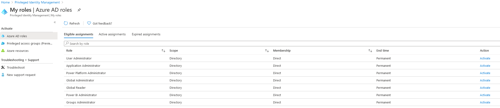

# pimcli
  

pimcli is a command line tool to activate Azure Active Directory Privileged Identity Management roles. 

> Pimcli uses the preview module of AzureAD, AzureADPreview (2.0preview) in order to use the provided Privileged Role Management commands




## Install from PowerShell Gallery
```Powershell
Install-Module pimcli
```

If enabling privileged roles for your organization requires MFA authentication when activating you will need to install `msal.ps` also.
See [https://github.com/AzureAD/MSAL.PS](https://github.com/AzureAD/MSAL.PS)


### Usage

```Powershell
#Get-Help pimcli

# Connect to the PIM service
Connect-PIM

# Activate role. Gives a menu to choose roles to activate
Enable-PrivilegedRoleAssignment

# Allows you to see available roles. Is not needed to activate roles
Get-PrivilegedRoleAssignments

```

## Demo


## Running tests
```Powershell
Invoke-Pester -Output Detailed .\Public\Connect-pim.Tests.ps1
```